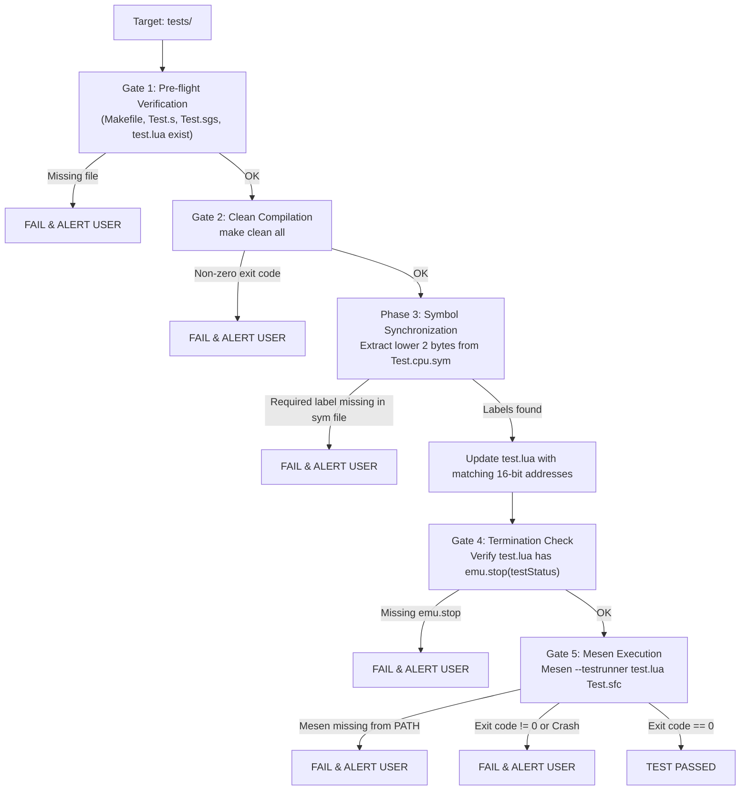

# Running SuperFX Unit Tests

This skill guides the automated compilation, symbol address synchronization, and execution of SuperFX (GSU / FX3) unit tests within the `tests/` directory using Mesen CE's headless test runner.

> [!NOTE]
> **Skill Distinction**:
> - Use **`run-gsu-test`** (this skill) to build and run **existing** tests in `tests/<feature>`.
> - Use **`create-gsu-test`** to scaffold **new** test suites from `tests/test_template`.

---

## Workflow Overview

Each test execution follows a strict 5-stage pipeline with fail-fast validation gates:



---

## Step-by-Step Instructions

### Step 1: Pre-flight Directory & File Check
Verify the target test directory and ensure all required files exist:
- Target must be a feature test directory (e.g. `tests/sqrt`, `tests/vector3_add`).
- Never run on `tests/test_template` directly (it is an unconfigured template).
- Required files:
  - `Makefile`: Toolchain build script.
  - `Test.s`: SNES 65816 harness setting up memory and starting the GSU.
  - `Test.sgs`: GSU assembly harness invoking the routine under test.
  - `test.lua`: Verification script controlling execution and assertions.

*Fail-Fast*: If any file is missing, stop immediately and alert the user.

---

### Step 2: Clean Compilation (`make clean all`)
Always rebuild cleanly to ensure binary and symbols reflect the latest source code:

```bash
make -C tests/<test_name> clean all
```

Verify:
1. Build exits with code 0.
2. `tests/<test_name>/Test.cpu.sym` exists.
3. `tests/<test_name>/Test.sfc` exists.

*Fail-Fast*: If `make` fails, do not proceed. Alert the user with the compilation or linker error.

---

### Step 3: Synchronize Symbol Addresses (`test.lua` $\leftarrow$ `Test.cpu.sym`)
In SuperFX testing, Mesen executes callbacks at 16-bit Work RAM addresses. The lower 2 bytes (`address & 0xFFFF`) of symbols in `Test.cpu.sym` must match the label addresses defined in `test.lua`.

Use the synchronization tool [sync_test_labels.py](./scripts/sync_test_labels.py):

```bash
python3 .agents/skills/run-gsu-test/scripts/sync_test_labels.py tests/<test_name>/Test.cpu.sym tests/<test_name>/test.lua
```

This script:
1. Extracts all exported symbol offsets from `Test.cpu.sym`.
2. Inspects `test.lua` for label assignments (`test_setup`, `test_start`, `test_stop`, `INPUT*`, `OUTPUT*`, etc.).
3. Updates `test.lua` in-place with the matching 16-bit hex addresses (`0x%04X`).
4. Verifies word alignment: Checks that data buffer symbols are located at even memory addresses.
5. Verifies required callbacks: Confirms that critical harness labels (such as `test_stop`) are present in `Test.cpu.sym`.

*Fail-Fast*: If a required label is missing from `Test.cpu.sym` or an address is unaligned, the script exits with code 1. Stop immediately and report the error to the user.

---

### Step 4: Emulation Termination Check (`emu.stop(testStatus)`)
Before launching the emulator, verify that `test.lua` includes explicit termination calls:
- Must invoke `emu.stop(0)` on pass.
- Must invoke `emu.stop(1)` (or non-zero) on failure.

*(This check is performed automatically by `sync_test_labels.py`).*

*Fail-Fast*: If `emu.stop` is missing, stop immediately. Running without `emu.stop` causes Mesen to execute indefinitely or time out.

---

### Step 5: Headless Mesen Execution
Ensure `Mesen` is on the system PATH (`which Mesen`).

Execute the test using the runner script:

```bash
./.agents/skills/run-gsu-test/scripts/run_test.sh tests/<test_name>
```

Or execute directly with Mesen inside the test directory:

```bash
Mesen --testrunner test.lua Test.sfc
```

> [!IMPORTANT]
> Always pass `--testrunner` without a hyphen between "test" and "runner". Passing `--test-runner` will inadvertently launch Mesen in interactive GUI mode.

Evaluate the exit code:
- **`0`**: Test passed successfully.
- **Non-zero**: Test assertion failure or runtime exception. Alert the user with the failure log and exit code.

---

## Batch Verification Example

To verify multiple tests in sequence:

```bash
for test in sqrt vector3_add reciprocal length normalize rom_to_ram; do
    echo "Running $test..."
    ./.agents/skills/run-gsu-test/scripts/run_test.sh "tests/$test" || exit 1
done
```

